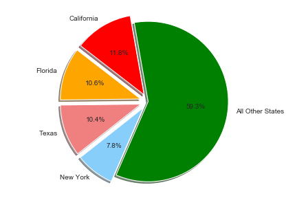
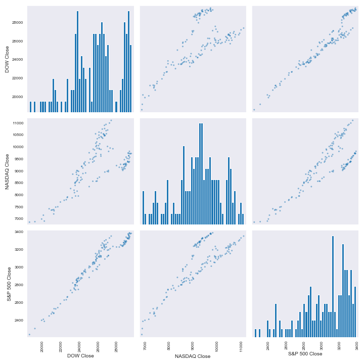
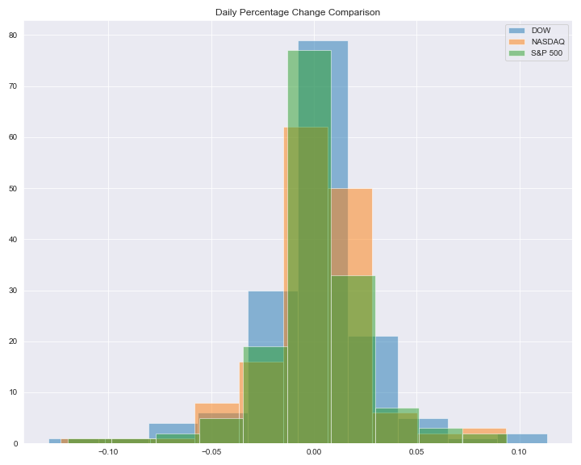
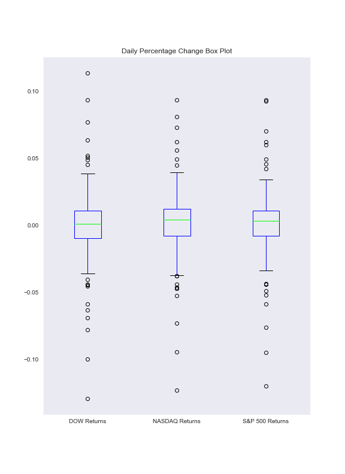
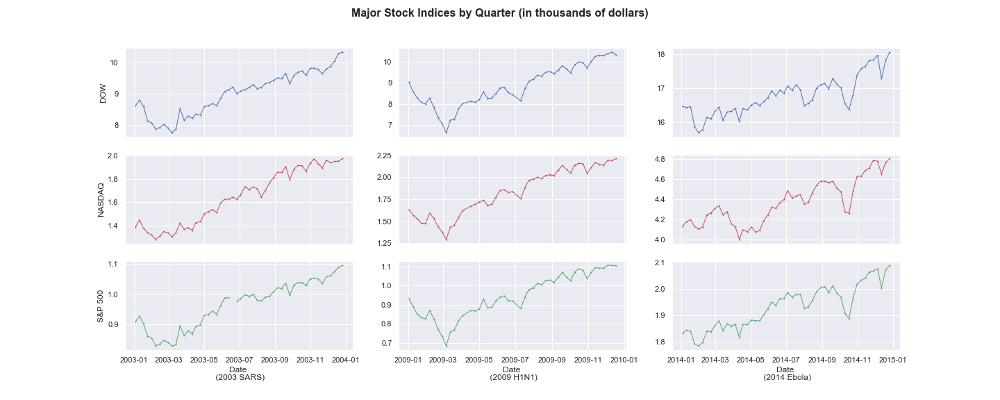

# StockMarket Analysis

### OVERVIEW
In this project, a basic analysis of the stock market is performed to answer the following questions:

1. How has the stock market performed over the last few years?
2. How has the stock market performed YTD amidst COVID-19?
3. How did the stock market react in previous epidemics/pandemic?

### PROCESS
The logic behind the project was to utilize the massive dataset available from Finnhub API to understand the stock market better. As the data was examined closely, new questions surfaced which required additional data sources. For extensive data on COVID-19, Kaggle provided a dataset broken down to the counties level. Moreover, other financial datasets were used to fill in the missing pieces of the story.

Once the data was extracted from the respective sources using Python, Pandas was used to transform and clean up the data. To visualize, Python libraries Matplotlib and Seaborn were used, which allowed a variety of figures.

### ANALYSIS
Throughout history, the stock market has proven to be resilient in the face of adversity. Since the beginning, the stock market has only climbed, with slight corrections along the way, however the general trends show and upward movement. COVID-19 appears to be no exception, as it manages to create an initial impact but the stock market quickly recovered and continued on its growth trajectory. Even though the number of cases and deaths in the US are alarming, the stock market appears unaffected. These trends are similar to how the stock market reacted to previous epidemics and pandemics. However, one thing that distinguishes COVID-19 from any previous pandemics is the unprecedented aide provided by the Federal and State governments. The assistance is one of the reasons the stock market appears to be defying reality. Therefore, this basic analysis does not provide any foundation to predict how the stock market will perform in the future.

Figure1: You are able to observe the upward trend for all the major stock indices since 1977. The major spike in year 2000 represents the bursting of the Dot.com, or technology, bubble.

Figure3: The states with the highest COVID-19 cases are demonstrated.

Figure12: Relationship Matrix for the three indices shows a positive correlation YTD.

Figure13: Candlestick for DOW index YTD shows greatest impact at the end of March 2020.

Figure19: A comparison of the daily percentage change for all the indices.

Figure21: Another comparison of the daily percentage change in a box plot.

Figure23: Comparison of some of the previous epidemics/pandemics in US history and their impact on the stock market.

### TOOLS USED
1. Python
2. Pandas
3. REST API
4. Matplotlib
5. Seaborn

### RESOURCES USED
1. Finnhub API (https://finnhub.io/api/v1)
2. Kaggle - us_counties_covid19_daily(CSV)
3. Yahoo Finance
4. data.world - "Stock Market from a High Level"

### FULL LIST OF FIGURES
 * Figure 1: Major Stock Indices Since 1977
 * Figure 2: Number Of Reported COVID-19 Cases By State
 * Figure 3: States With Most Cases
 * Figure 4: COVID-19 Cases And Deaths In The US Since March
 * Figure 5: Opening Prices Of Each Index YTD
 * Figure 6: Adjusted Closing Prices Of Each Index YTD
 * Figure 7: Trade Volume Per Day For Each Index YTD
 * Figure 8: Total Market Cap
 * Figure 9: Moving Average For DOW
 * Figure 10: Moving Average For NASDAQ
 * Figure 11: Moving Average for S&P 500
 * Figure 12: Relationship Matrix
 * Figure 13: DOW Candlesticks
 * Figure 14: NASDAQ Candlesticks
 * Figure 15: S&P 500 Candlesticks
 * Figure 16: DOW Daily Percentage Change
 * Figure 17: NASDAQ Daily Percentage Change
 * Figure 18: S&P 500 Daily Percentage Change
 * Figure 19: Daily Percentage Change Comparison
 * Figure 20: Kernel Density Estimate (kde) Comparison
 * Figure 21: Daily Percentage Change Box Plot
 * Figure 22: Indices Cumulative Return
 * Figure 23: Stock Market Case Study

***DISCLAIMER***

THE FOLLOWING IS A BASIC ANALYSIS OF THE STOCK MARKET IN RESPONSE TO COVID-19 AND SOME OF THE PREVIOUS EPIDEMICS/PANDEMICS, HOWEVER IT IS NOT A FORECAST OF HOW THE MARKET WILL PERFORM IN THE FUTURE. NO MACHINE LEARNING OR PREDICTIVE MODELS HAVE BEEN USED FOR THIS PROJECT.

MOREOVER, THE UNITED STATES GOVERNMENT'S RESPONSE TO COVID-19 HAS BEEN UNPRECENDENTED, THEREFORE COMPARING IT TO HISTORICAL TRENDS IS UNFAIR BUT FOR THE SAKE OF THIS PROJECT AN ANALYSIS HAS BEEN PERFORMED TO HELP VISUALIZE AND UNDERSTAND THE STOCK MARKET BETTER.
